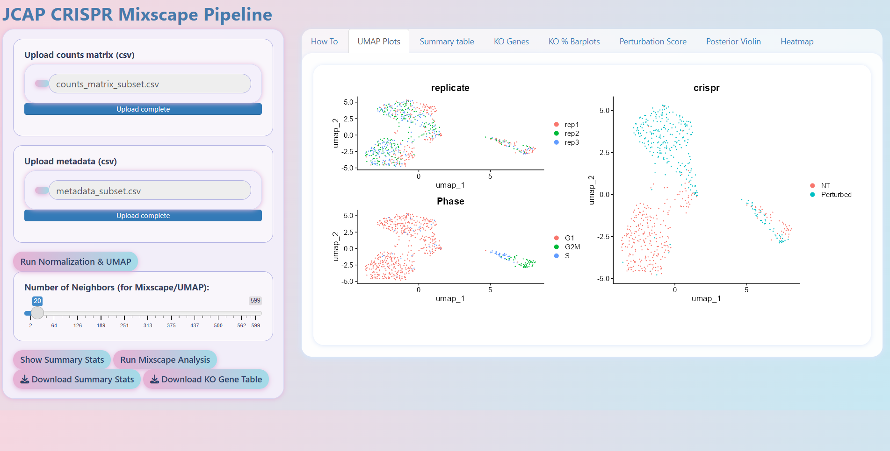
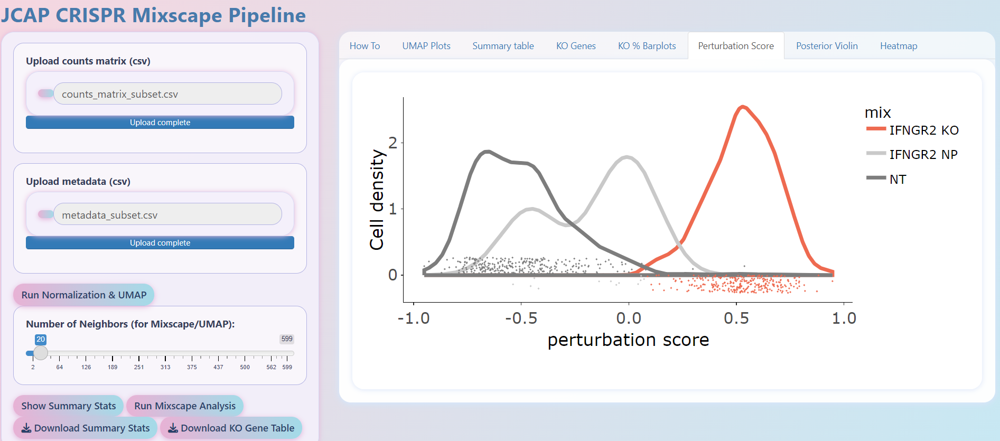

# JCAP CRISPR Mixscape Pipeline
[](LICENSE)
[](https://cran.r-project.org/)
[](https://shiny.posit.co/)
[](https://github.com/jcaperella29/Perturb_seq_app/issues)
[](https://github.com/jcaperella29/Perturb_seq_app/commits/main)


Welcome to the **JCAP CRISPR Mixscape Pipeline**, a user-friendly Shiny application for interactive single-cell CRISPR analysis using the Mixscape workflow from [Seurat](https://satijalab.org/seurat/articles/mixscape_vignette.html).


---

## 📁 Repository Structure

Perturb_seq_app/
│
├── CRISPR_APP/ # Main Shiny app code
│ └── (app.R, custom.css, How_To.txt, etc.)
│
├── sample_data/ # Example input data files
│ ├── counts_matrix.csv
│ └── metadata.csv
│
└── readme.md

---

## 🌟 Features

- **Upload your own count matrix and metadata**
- **Automated QC, normalization, HVG selection**
- **UMAP visualization**
- **Mixscape perturbation score calculation**
- **KO/NP/NT class assignment**
- **Interactive plots (barplots, violin plots, heatmaps, etc)**
- **Downloadable differential gene expression (KO vs NT) tables**
- **Summary statistics for your dataset**
- **Downloadable summary table**
- **In-app How To guide and pastel garden CSS theme**

## 📸 Screenshots

Below are example outputs generated by the JCAP CRISPR Mixscape Pipeline app:

**UMAP Plots**  


**Perturbation Score Plot**  


**KO % Barplots**  


---


## 🚀 Getting Started

### 1. Install R and dependencies

```r
# In R/RStudio, run:
install.packages(c("shiny", "Seurat", "dplyr", "ggplot2", "patchwork", "plotly", "DT"))

2. Clone this repository
 in bash
git clone https://github.com/jcaperella29/Perturb_seq_app.git
cd Perturb_seq_app

3. Launch the App
in r/r studio console run

shiny::runApp("CRISPR_APP")

📂 Input Data Format
Counts matrix: CSV, cells as columns, genes as rows.

Metadata: CSV, one row per cell, with required columns: gene, replicate, guide_ID, etc.

Example data: See sample_data/ for ready-to-use demo files.

🖱️ Using the App
Upload the sample or your own counts and metadata CSVs.

Click Run Normalization & UMAP to process.

Adjust Number of Neighbors if desired.

Click Run Mixscape Analysis.

Explore results in tabs:

UMAP Plots

Summary Table

KO Genes (downloadable)

KO % Barplots

Perturbation Score

Posterior Violin

Heatmap

How To

Download tables as needed!

See the "How To" tab or How_To.txt for step-by-step instructions.


📊 Example Data
sample_data/counts_matrix.csv
sample_data/metadata.csv

These files are small demo sets so you can test the full app without needing a large CRISPR dataset.

🎨 Customization
Theme: Custom CSS (CRISPR_APP/www/custom.css) inspired by Les Carnets de l’Apothicaire.

Modular: Edit code in CRISPR_APP/app.R for your own needs!

🛟 Support & Issues
If you have problems, please open an issue.

🙏 Credits
Seurat Mixscape: Satija Lab

UI Art Inspiration: Les Carnets de l’Apothicaire

Author: @jcaperella29

📄 License
MIT License.

Enjoy your CRISPR screens and happy data exploring! 🌸


